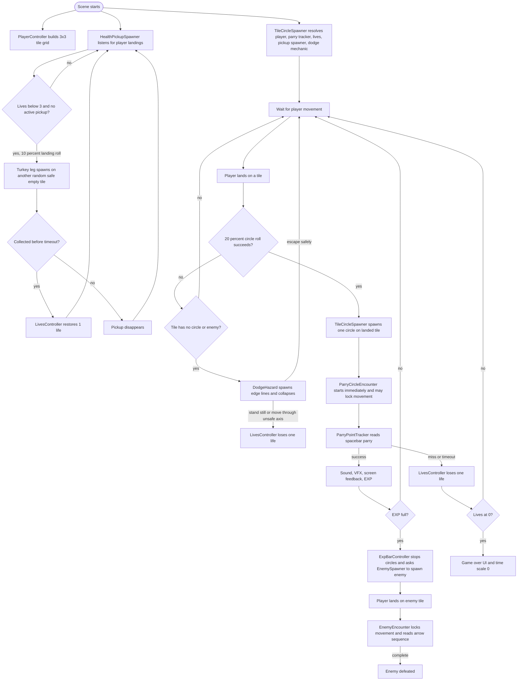

# TigerSamurai Class Diagram

Last updated: 2026-05-04

This diagram covers the gameplay scripts in `Assets/Scripts`. It focuses on project-script relationships, not every Unity engine type each script touches.

## Main Script Relationships

```mermaid
classDiagram
    direction LR

    class PlayerController {
        +event StartedMoveFromTile(Transform,Transform,Vector2Int)
        +event LandedOnTile(Transform)
        +Transform CurrentTileTransform
        +bool AreControlsLocked
        +SetControlsLocked(bool)
    }

    class TileCircleSpawner {
        -List~ParryCircleEncounter~ activeEncounters
        -HealthPickupSpawner healthPickupSpawner
        -DodgeMechanic dodgeMechanic
        +StopSpawningAndClearActiveCircle()
        -HandlePlayerLanded(Transform)
        -SpawnCircleOnTile(...)
        -SpawnCircleWave()
        -ClearUnchosenEncounters(ParryCircleEncounter)
    }

    class ParryCircleEncounter {
        +event Resolved(ParryCircleEncounter,bool)
        +Transform TargetTile
        +float NormalizedSize
        +bool CanAttemptCurrentStage
        +bool IsEngaged
        +bool IsLockingPlayer
        +string DifficultyLabel
        +Initialize(...)
        +TryResolveParry(out bool)
        +HandleMissedParryAttempt()
        +StartIfPlayerIsOnTargetTile()
        +IsOnTile(Transform)
    }

    class ParryCircleSettings {
        +string Label
        +Color CircleColor
        +int RequiredParries
        +bool LockPlayerOnTile
        +CreateWhiteDefaults()
        +CreateRedDefaults()
        +CreateBlueDefaults()
        +CreateBlackDefaults()
        +GetStageWindow(...)
    }

    class StageProfile {
        +float ShrinkDuration
        +float ParryWindowDurationSeconds
        +float ExpandDuration
    }

    class ParryPointTracker {
        -List~ParryCircleEncounter~ activeCircles
        +int ParryPoints
        +RegisterCircle(ParryCircleEncounter)
        +UnregisterCircle(ParryCircleEncounter)
        +HasActiveEncounterOnTile(Transform)
        +HasMovementLockingEncounter()
    }

    class ParryScreenFeedback {
        +PlayParryFeedback()
        +PlayParryFeedback(Vector3)
        +ResetParryZoomStreak()
    }

    class ExpBarController {
        +int CurrentParryExp
        +int ParriesForFullBar
        +float Progress
        +AddParryExp(int)
        +ResetBar()
    }

    class EnemySpawner {
        +SpawnEnemy()
    }

    class EnemyEncounter {
        +Transform TargetTile
        +Initialize(PlayerController, Transform, EnemyPromptSpriteSet)
        +IsOnTile(Transform)
    }

    class EnemySequencePopup {
        +Initialize(Transform, Vector3, int)
        +SetSequence(Sprite[], int)
        +FlashFailure()
        +FlashSuccess()
    }

    class EnemyPromptSpriteSet {
        <<struct>>
        +Sprite Up
        +Sprite Down
        +Sprite Left
        +Sprite Right
    }

    class LivesController {
        +int CurrentLives
        +int MaxLives
        +bool CanRestoreLife
        +bool IsGameOver
        +LoseLife()
        +RestoreLife(int)
    }

    class HealthPickupSpawner {
        +Configure(Transform, PlayerController, LivesController)
        +HasActivePickupOnTile(Transform)
        +ClearActivePickup()
        +ClearIfOnTile(Transform)
        -TrySpawnRandomPickup()
    }

    class HealthPickup {
        +Transform TargetTile
        +Initialize(Transform, PlayerController, LivesController)
    }

    class DodgeMechanic {
        +Configure(Transform, PlayerController, ParryPointTracker, LivesController)
        -HandlePlayerLanded(Transform)
        -SpawnHazard(Transform)
    }

    class DodgeHazard {
        +Transform TargetTile
        +Initialize(...)
        -HandlePlayerStartedMove(Transform,Transform,Vector2Int)
    }

    class ShrinkingCircle {
        +Transform TargetTile
        +float NormalizedSize
        +Initialize(...)
        +Consume()
    }

    TileCircleSpawner --> PlayerController : listens for landings
    TileCircleSpawner --> ParryPointTracker : avoids occupied circle tiles
    TileCircleSpawner --> LivesController : loses life on failed circle
    TileCircleSpawner --> HealthPickupSpawner : configures pickup spawner
    TileCircleSpawner --> DodgeMechanic : configures dodge pressure layer
    TileCircleSpawner ..> ParryCircleEncounter : creates landed-tile circles
    TileCircleSpawner ..> ParryCircleSettings : chooses difficulty
    TileCircleSpawner ..> EnemyEncounter : avoids enemy-occupied tiles

    ParryCircleEncounter --> PlayerController : listens for landing and locks controls
    ParryCircleEncounter --> ParryPointTracker : registers/unregisters itself
    ParryCircleEncounter *-- ParryCircleSettings : uses copied settings
    ParryCircleSettings *-- StageProfile : contains stage profiles
    ParryCircleEncounter ..> TileCircleSpawner : Resolved event consumed by spawner

    ParryPointTracker --> PlayerController : reads current tile
    ParryPointTracker --> ParryCircleEncounter : validates and resolves parry
    ParryPointTracker --> ParryScreenFeedback : shake, flash, zoom
    ParryPointTracker --> ExpBarController : adds parry EXP

    ExpBarController --> TileCircleSpawner : stops circles when full
    ExpBarController --> EnemySpawner : spawns enemy when full

    EnemySpawner --> PlayerController : avoids player tile
    EnemySpawner --> EnemyPromptSpriteSet : passes prompt sprites
    EnemySpawner ..> EnemyEncounter : creates enemy encounter

    EnemyEncounter --> PlayerController : listens for landing and locks controls
    EnemyEncounter --> EnemyPromptSpriteSet : maps sequence inputs to sprites
    EnemyEncounter ..> EnemySequencePopup : creates prompt UI

    HealthPickupSpawner --> LivesController : checks heal eligibility
    HealthPickupSpawner --> PlayerController : passes player to pickup
    HealthPickupSpawner --> ParryPointTracker : skips circle tiles
    HealthPickupSpawner --> DodgeMechanic : skips active dodge hazard tiles
    HealthPickupSpawner ..> HealthPickup : creates pickup

    HealthPickup --> PlayerController : listens for landing
    HealthPickup --> LivesController : restores life

    DodgeMechanic --> PlayerController : listens for landings
    DodgeMechanic --> ParryPointTracker : skips circle tiles
    DodgeMechanic --> HealthPickupSpawner : skips pickup tiles
    DodgeMechanic --> LivesController : passes damage target
    DodgeMechanic ..> DodgeHazard : creates line hazards

    DodgeHazard --> PlayerController : listens for movement start
    DodgeHazard --> LivesController : deals 1 life damage

    PlayerController ..> ParryCircleEncounter : LandedOnTile event
    PlayerController ..> TileCircleSpawner : LandedOnTile event
    PlayerController ..> EnemyEncounter : LandedOnTile event
    PlayerController ..> HealthPickup : LandedOnTile event
    PlayerController ..> DodgeHazard : StartedMoveFromTile event
```

## Runtime Flow

## Main Responsibility Boundaries

- `PlayerController` owns grid movement, movement buffering, dash/parry animation triggers, and the `LandedOnTile` event.
- `TileCircleSpawner` owns movement-triggered circle rolls, landed-tile circle spawning, difficulty selection, and stopping active circles for the enemy phase.
- `ParryCircleEncounter` owns one circle's timing state, stage progression, failure/completion, and movement lock for that encounter.
- `ParryPointTracker` owns parry input, active circle lookup, parry success feedback, parry points, and EXP gain.
- `ExpBarController` owns EXP UI animation and the current full-bar transition into the enemy phase.
- `EnemySpawner`, `EnemyEncounter`, and `EnemySequencePopup` own the enemy phase: spawn, input sequence, and prompt display.
- `LivesController` owns life count, healing, and game-over UI/time freeze.
- `HealthPickupSpawner` owns landing-triggered turkey-leg spawn rolls, safe random tile selection, pickup lifetime, and cleanup; `HealthPickup` owns collection and restoring one life.
- `DodgeMechanic` owns when dodge hazards spawn and which tiles are skipped; `DodgeHazard` owns line visuals, collapse timing, unsafe movement checks, and damage.
- `ShrinkingCircle` is a simpler legacy circle behavior. The current main parry flow uses `ParryCircleEncounter`.

## Feature Planning Notes

- New circle colors or patterns can currently be added through `ParryCircleEncounter.Settings`, then surfaced through `TileCircleSpawner` selection logic.
- A triangle hold-parry enemy should probably be a new encounter type, not more code inside `TileCircleSpawner`. A future `EncounterSpawner` or `BoardEncounterSpawner` could choose between circle, triangle, and other encounter prefabs.
- More powerups should follow the turkey-leg split: one small pickup behavior plus a dedicated spawner/manager, with `TileCircleSpawner` only coordinating board timing if needed.
- The old timed two-circle wave code still exists as a `TileCircleSpawner` mode, but the current prototype path is the 20% player-landing spawn roll.
- The dodge hazard should stay tuneable through `DodgeMechanic` until its pacing is proven. Likely knobs are warning duration, collapse duration, spawn chance, and whether enemy tiles should stay skipped.
- If circle difficulty keeps growing, `ParryCircleEncounter.Settings` is a strong candidate to become ScriptableObject data. That would shrink `TileCircleSpawner` and make difficulty tuning more Inspector-friendly.
- Enemy variants should likely split from `EnemyEncounter` once their input rules differ. For example, a base enemy encounter interface or abstract class could let `EnemySpawner` create different enemy behavior components.
